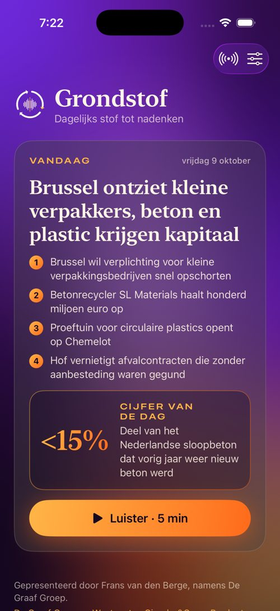
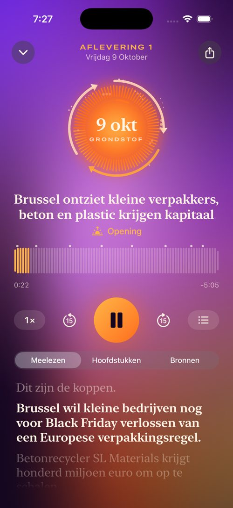

# Grondstof 🟣🟠

**Dagelijks stof tot nadenken.** Elke ochtend om negen uur vijf minuten zakelijk nieuws over
duurzaamheid en circulaire economie, ingesproken met de gekloonde stem van Frans van den Berge,
namens De Graaf Groep, Wastenet, Circular&Co. en Product for Product.

> *Afval bestaat niet, het is grondstof. Nieuws ook: elke ochtend verwerkt tot vijf minuten inzicht.*

<p align="center">
  
  
</p>

<sub>Screenshots uit de iPhone-simulator in de CI (met een testtoon in plaats van de stem).</sub>

```
 08:30  Claude-routine (redactie)      zoekt het nieuws, schrijft redactie/JJJJ-MM-DD.json, pusht
   │
   ▼
 08:40  GitHub Action "Studio"          ElevenLabs Eleven v4 (jouw stemkloon) → montage met tunes
   │                                    → MP3 (−16 LUFS) + transcript met tijdcodes + golfvorm
   ▼
 08:45  GitHub Action "Publiceren"     GitHub Pages: RSS-feed · episodes.json · webspeler
   │
   ├──▶ iPhone-app Grondstof           met animaties op de echte golfvorm en meelezen
   ├──▶ Spotify / Apple Podcasts       halen de RSS-feed zelf op
   └──▶ Website                        frains-software.github.io/Podcast-duurzaamheid

 09:25  Vangnet                         geen aflevering? Dan schrijft Claude (API) hem alsnog.
```

## Wat zit er in deze repository

| Map | Inhoud |
|---|---|
| `ios/` | Native iPhone-app (SwiftUI, iOS 18+). Open `ios/Grondstof.xcodeproj` in Xcode. |
| `studio/` | De productiestraat in Python: valideren, inspreken (ElevenLabs), monteren, feed bouwen. |
| `redactie/` | Het **redactiestatuut** en de dagelijkse scripts. `2026-10-09.json` is de pilotaflevering. |
| `episodes/` | Per aflevering de metadata: hoofdstukken, transcript met tijdcodes, golfvorm, bronnen. |
| `site/` | De webspeler die samen met de feed op GitHub Pages komt. |
| `assets/` | Cover (3000×3000), app-icoon, lettertypes (OFL). De tunes worden procedureel gegenereerd. |
| `podcast.toml` | Eén centrale configuratie: naam, presentator, stem, publicatietijd, feed. |

## Eenmalig instellen (± 10 minuten)

1. **ElevenLabs-sleutel.** Ga naar *Settings → Secrets and variables → Actions* en voeg het geheim
   `ELEVENLABS_API_KEY` toe. De studio zoekt zelf je gekloonde stem op. Heb je er meer dan één, zet
   dan de *variable* `ELEVENLABS_VOICE_ID`.
2. **GitHub Pages.** Ga naar *Settings → Pages → Build and deployment → Source* en kies **GitHub Actions**.
   Let op: voor een privé-repository is GitHub Pro (of Team) nodig. Anders maak je de repository publiek.
3. **E-mailadres voor de feed.** Zet in `podcast.toml` bij `owner_email` een zakelijk adres. Daar stuurt
   Spotify de verificatiecode naartoe. Dit adres wordt openbaar in de feed.
4. **Pilot draaien.** Ga naar *Actions → Studio → Run workflow* met datum `2026-10-09`. Na een paar minuten
   staan de audio, de feed en de website online.
5. **Optioneel, het vangnet.** Voeg het geheim `ANTHROPIC_API_KEY` toe. Mist de routine een keer, dan
   schrijft Claude (Opus 5.5 met webzoeken) om 09:25 alsnog het bulletin.

### Op Spotify zetten
In de app vind je onder het zendmast-icoon de stappen en de feed-URL om te kopiëren:

1. Kopieer `https://frains-software.github.io/Podcast-duurzaamheid/feed.xml`.
2. Open [Spotify for Creators](https://creators.spotify.com) en kies *Nieuwe show → Ik heb al een podcast → RSS-feed*.
3. Bevestig met de code die naar `owner_email` gaat.
4. Zet de Spotify-link bij `spotify_url` in `podcast.toml`. App en website tonen dan *Live op Spotify*.

Spotify haalt daarna elke nieuwe aflevering automatisch op. Dezelfde feed werkt ook voor Apple
Podcasts ([Podcasts Connect](https://podcastsconnect.apple.com)), Pocket Casts en Overcast.

### De app op je iPhone
Open `ios/Grondstof.xcodeproj` in Xcode (16 of nieuwer). Kies bij *Signing & Capabilities* je team,
sluit je iPhone aan en druk op ▶︎. Voor TestFlight of de App Store kies je *Product → Archive*.
De bundle-ID is `nl.degraafgroep.grondstof`; die kun je aanpassen.

**Wat de app doet**
- Een levende paars-oranje achtergrond (MeshGradient) die tijdens het afspelen meebeweegt met de stem.
- **De Kringloop**: drie draaiende pijlen rond een ring van golfvormstaven en rondcirkelende
  "grondstofdeeltjes". De energie komt uit de golfvorm die de studio vooraf berekent, dus de animatie
  loopt echt synchroon met de audio.
- **Meelezen**: de zin die Frans uitspreekt licht op en scrolt mee. Tik op een zin om erheen te springen.
- Hoofdstukken, bronnen per bericht en *het cijfer van de dag*.
- Achtergrondaudio, bediening vanaf het vergrendelscherm, AirPlay, snelheid (0,85× tot 1,5×) en hervatten.
- Een seintje om 09:05, *"Hé Siri, speel Grondstof"*, delen, en een aftelklok tot de volgende aflevering.
- Publicatiescherm voor Spotify met live controle of de feed bereikbaar is.

## Zelf draaien

```bash
pip install -r studio/requirements.txt          # en ffmpeg
python -m studio validate 2026-10-09            # controleer een script
python -m studio produce 2026-10-09 --fake-voice  # test de montage zonder ElevenLabs
ELEVENLABS_API_KEY=… python -m studio produce 2026-10-09
python -m studio site                           # bouw _site/ (feed, json, webspeler)
python -m studio assets                         # tunes, cover en app-icoon opnieuw genereren
```

## Redactie en stem

**De redactie sturen:** pas `redactie/REDACTIEWENSEN.md` aan via GitHub (potloodje, daarna *Commit changes*).
Daar zet je onderwerpen, bronnen en eenmalige tips; de redactie leest het elke ochtend. Welke bronnen er
gebruikt zijn, zie je per aflevering in de app (tab *Bronnen*), in de shownotes en in `redactie/JJJJ-MM-DD.json`.

**Uitspraak:** lastige namen staan in `podcast.toml` onder `[pronunciation]` (bijvoorbeeld Wastenet → Weestnet).
In de app en het transcript blijft de echte schrijfwijze staan.

- Het **redactiestatuut** (`redactie/REDACTIESTATUUT.md`) legt vast hoe een aflevering klinkt: een
  rustig, zakelijk bulletin met een opening en koppen, vier berichten met telkens een tune ertussen,
  een duiding vanuit de praktijk van de De Graaf-bedrijven (zonder verkooppraatje), het cijfer van de
  dag en een afsluiting. Het statuut schrijft ook voor hoe je schrijft voor het oor: getallen voluit,
  geen afkortingen en korte zinnen.
- **Stem:** ElevenLabs `eleven_v4` met je (professionele of instant) stemkloon. De stabiliteit staat
  wat hoger (0,62) voor de rustige voordracht van een nieuwslezer. Alles is aan te passen in `podcast.toml`.
- **Muziek:** de opening, de overgangen en de slottune zijn met code gecomponeerd: een tikkende
  nieuwsklok, een warme Rhodes in D-majeur en een klokaccent. Er zijn dus geen rechten nodig. Wil je
  eigen muziek, zet dan `assets/audio/intro.mp3`, `stinger.mp3` en `outro.mp3` neer.
